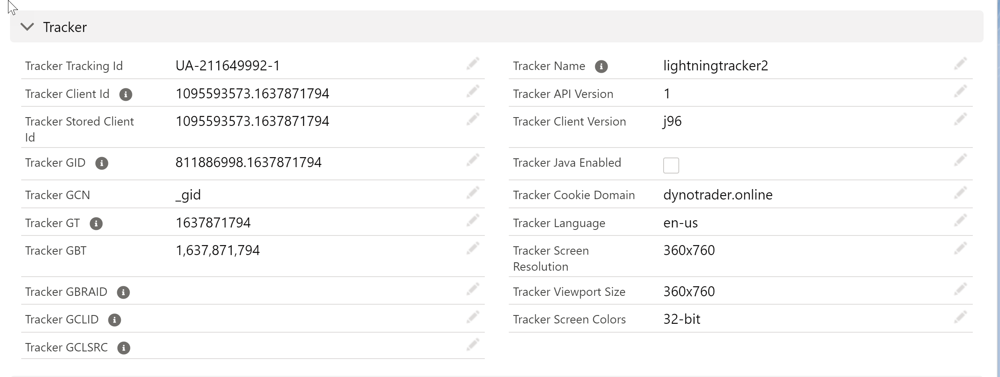
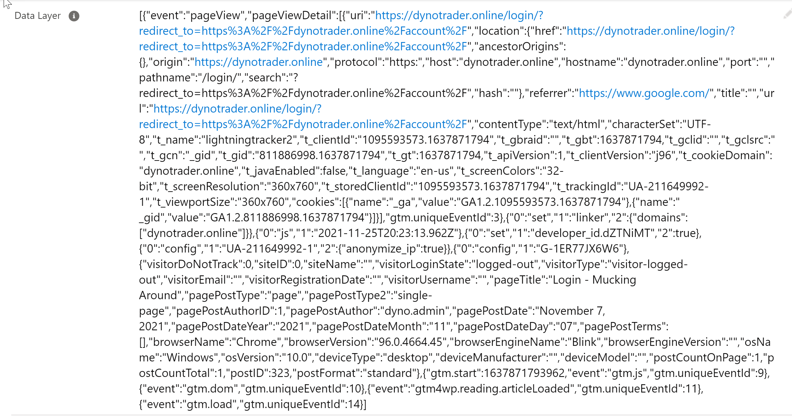
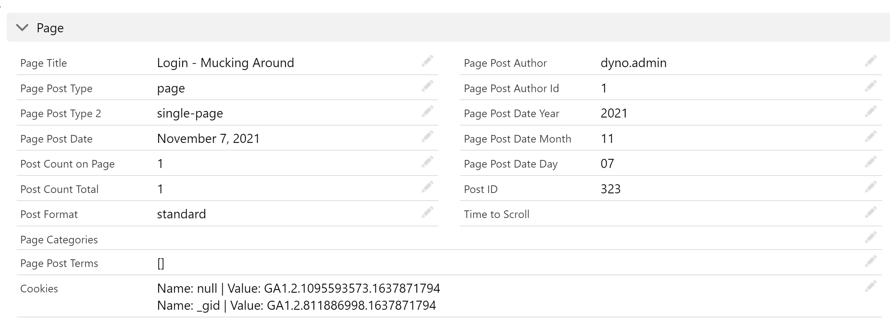
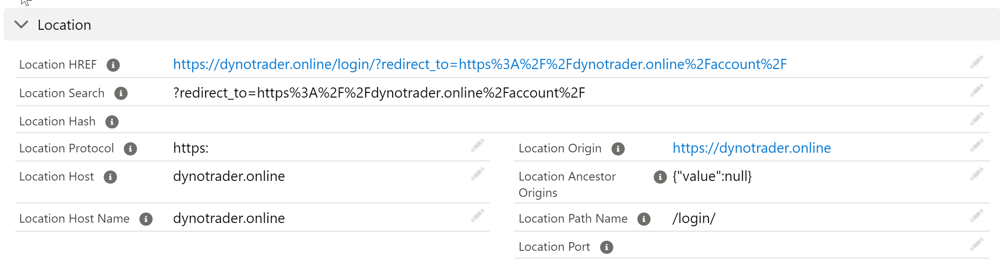
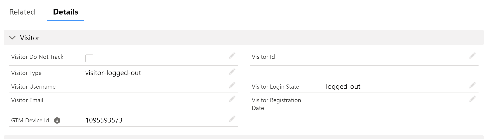
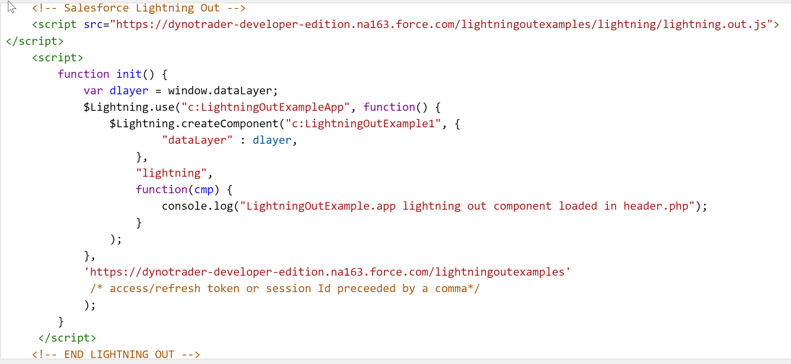

# addelytics
Google Analytics  integration with Salesforce for associating Salesforce List Emails and Mass Emails with Site Visitors.

For a full walkthrough of how this is setup and what needs to be configured within the header files on your website, visit https://dynotrader.online.  This is a dummy site I use to test these things out.  Requires registration to view documentation.

## Google Analytics and Google Tag Manager Integration
Tracker standard GA tracking codes, click Ids, Google Ads Ids and other information stored in Google Analytics passed through to Salesforce.
### GA Tracker Data

### GTM DataLayer
Pass the entire Google Tag Manager Data Layer object to Salesforce on custom and page view events.

## Parsing the Data Layer
Classes to parse form submissions (Salesforce web-to-lead and custom forms), location data (see MDN), visitor information (logged in and logged out), local and session storage for cookies, GA trackers, and more.

### Page

### Location

### Visitor

### Document

## Lead Association
Supports pushing the GA Client Id with Salesforce Web-to-Lead form submissions so that people can be associated with page views, form submissions, and other custom events such as campaign email tracking.

Salesforce Lightning Out
This integration uses Lightning Out to facilitate the integration between the website and Salesforce.

Website Header Modifications
The following script will deploy a lightning out application into any website where it is placed into the header file.

TO DO's and Known Issues
- Implement JSForce into website to connect with SF via connected app to secure connection.  Currently runs in guest user mode.
- Add parser to seperate search strings from URL for easier association back to campaigns and list emails
- Move Tag Manager attribution on Apex Classes to meta data to make it end-user configurable
- UNIT TESTS!
